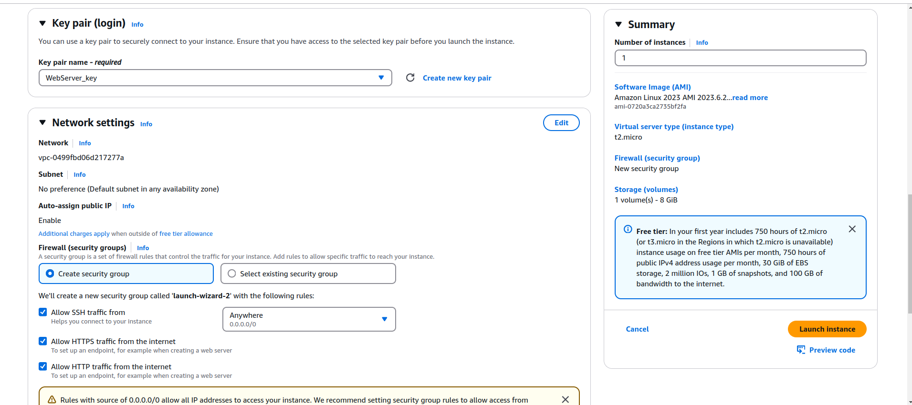

## 1. Create one EC2 instance of type t2.micro from Amazon Linux 2023 AMI. Create a new keypair with key pair login option. Make this instance accessible from the outside world via 22 and 80 ports.

<details>
<summary>Answer</summary>


</details>

## 2. Connect to this machine from your own machine via ssh.

<details>
<summary>Answer</summary>

```
$ chmod 400 "WebServer_key.pem"
$ ssh -i "WebServer_key.pem" ec2-user@ec2-34-247-161-119.eu-west-1.compute.amazonaws.com
```
</details>


## 3. Update the system and the packages installed on the system. “It may not need updating because it is newly installed”


<details>
<summary>Answer</summary>

```
$ chmod 400 "WebServer_key.pem"
$ ssh -i "WebServer_key.pem" ec2-user@ec2-34-247-161-119.eu-west-1.compute.amazonaws.com
```
</details>


## 4. Install git

<details>
<summary>Answer</summary>

```
$ sudo dnf install -y git
$ git version
```
</details>

## 5. Add a new user. Make this user able to sudo without asking for a password. 

<details>
<summary>Answer</summary>

```
$ sudo useradd proje
$ sudo passwd proje
$ sudo usermod -a -G wheel proje
$ su proje
$ sudo ls
$ exit
```
</details>


## 6. Create a folder called /home in root. Change the owner and group values of this folder to this newly created user and this user's home group. Then make sure that this user's home directory is the /evim folder. 

<details>
<summary>Answer</summary>

```
$ sudo mkdir /evim
$ sudo chown proje /evim
$ sudo chgrp proje /evim
$ cat /etc/passwd
$ sudo usermod -d /evim proje
$ cat /etc/passwd
```
</details>


## 7. Add a new network interface on AWS and attach it to your machine. Then add the ip address 10.10.10.10.10/255.255.255.255.0 to this interface. 

<details>
<summary>Answer</summary>

```
sudo ip address add 10.10.10.10/255.255.255.0 dev enX1
[ec2-user@ip-172-31-19-3 ~]$ ip address
1: lo: <LOOPBACK,UP,LOWER_UP> mtu 65536 qdisc noqueue state UNKNOWN group default qlen 1000
    link/loopback 00:00:00:00:00:00 brd 00:00:00:00:00:00
    inet 127.0.0.1/8 scope host lo
       valid_lft forever preferred_lft forever
    inet6 ::1/128 scope host noprefixroute
       valid_lft forever preferred_lft forever
2: enX0: <BROADCAST,MULTICAST,UP,LOWER_UP> mtu 9001 qdisc fq_codel state UP group default qlen 1000
    link/ether 06:33:d2:fe:1e:79 brd ff:ff:ff:ff:ff:ff
    altname eni-08f37ef7af6af66a1
    altname device-number-0
    inet 172.31.19.3/20 metric 512 brd 172.31.31.255 scope global dynamic enX0
       valid_lft 3059sec preferred_lft 3059sec
    inet6 fe80::433:d2ff:fefe:1e79/64 scope link
       valid_lft forever preferred_lft forever
3: enX1: <BROADCAST,MULTICAST,UP,LOWER_UP> mtu 9001 qdisc fq_codel state UP group default qlen 1000
    link/ether 06:bc:41:ce:e6:31 brd ff:ff:ff:ff:ff:ff
    inet 172.31.23.170/20 metric 512 brd 172.31.31.255 scope global dynamic enX1
       valid_lft 3571sec preferred_lft 3571sec
    inet 10.10.10.10/24 scope global enX1
       valid_lft forever preferred_lft forever
    inet6 fe80::4bc:41ff:fece:e631/64 scope link
       valid_lft forever preferred_lft forever
```
</details>


## 8. When going to 199.199.199.199.0/24, define the route that will allow it to go over this new interface. 

<details>
<summary>Answer</summary>

```
$ sudo ip route add 199.199.199.0/24 dev enX1
```
</details>


## 9. Install the Apache Web Server (httpd) service on the system. Also set this service to start automatically when the computer is restarted. 

<details>
<summary>Answer</summary>

```
$ sudo dnf install -y httpd
$ sudo systemctl status httpd.service
○ httpd.service - The Apache HTTP Server
     Loaded: loaded (/usr/lib/systemd/system/httpd.service; disabled; preset: disabled)
     Active: inactive (dead)
       Docs: man:httpd.service(8)
$ sudo systemctl enable httpd.service
Created symlink /etc/systemd/system/multi-user.target.wants/httpd.service → /usr/lib/systemd/system/httpd.service.

$ sudo systemctl start httpd.service
$ sudo systemctl status httpd.service
● httpd.service - The Apache HTTP Server
     Loaded: loaded (/usr/lib/systemd/system/httpd.service; enabled; preset: disabled)
     Active: active (running) since Mon 2023-09-25 10:33:48 UTC; 2s ago
       Docs: man:httpd.service(8)
   Main PID: 32961 (httpd)
     Status: "Started, listening on: port 80"
      Tasks: 177 (limit: 1114)
     Memory: 12.8M
        CPU: 67ms
     CGroup: /system.slice/httpd.service
             ├─32961 /usr/sbin/httpd -DFOREGROUND
             ├─32973 /usr/sbin/httpd -DFOREGROUND
             ├─32974 /usr/sbin/httpd -DFOREGROUND
             ├─32975 /usr/sbin/httpd -DFOREGROUND
             └─32976 /usr/sbin/httpd -DFOREGROUND

Sep 25 10:33:48 ip-172-31-19-3.eu-west-1.compute.internal systemd[1]: Starting httpd.service - The Apache HTTP Server...
Sep 25 10:33:48 ip-172-31-19-3.eu-west-1.compute.internal systemd[1]: Started httpd.service - The Apache HTTP Server.
Sep 25 10:33:48 ip-172-31-19-3.eu-west-1.compute.internal httpd[32961]: Server configured, listening on: port 80

$ curl 127.0.0.1
<html><body><h1>It works!</h1></body></html>
```
</details>

## 10. Create a 4gb EBS Volume and mount it to the instance you created. Create a single partition on it that uses the entire disk size and format it with xfs file system. Then mount this newly created space to /var/www/html using systemd. 


<details>
<summary>Answer</summary>

```
$ sudo fdisk -l
$ sudo fdisk /dev/xvdf
$ sudo mkfs -t xfs /dev/xvdf1
$ sudo systemctl stop httpd.service
$ diskuuid=$(blkid | grep /dev/xvdf1 | cut -d ' ' -f 2 | cut -d '"' -f 2
$ sudo bash -c 'cat > /etc/systemd/system/var-www-html.mount' << EOF
[Unit]
Description=DataDisk

[Mount]
What=/dev/disk/by-uuid/$diskuuid
Where=/var/www/html
Type=xfs
Options=defaults

[Install]
WantedBy=multi-user.target
EOF

$ sudo bash -c 'cat > /etc/systemd/system/var-www-html.automount' << EOF
[Unit]
Description=DataDisk Automount
ConditionPathExists=/var/www/html

[Automount]
Where=/var/www/html
TimeoutIdleSec=10

[Install]
WantedBy=multi-user.target
EOF


$ sudo systemctl daemon-reload
$ sudo systemctl enable var-www-html.mount
$ sudo systemctl start var-www-html.mount
$ sudo systemctl start httpd.service
```
</details>